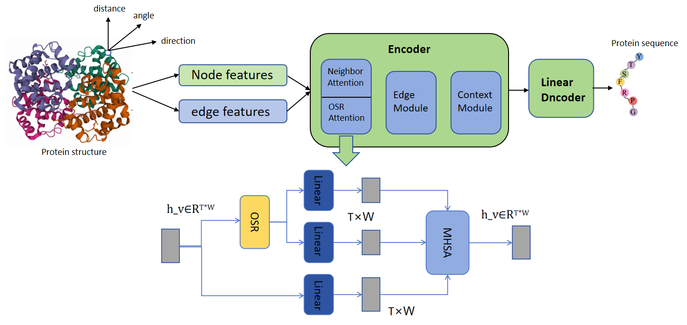
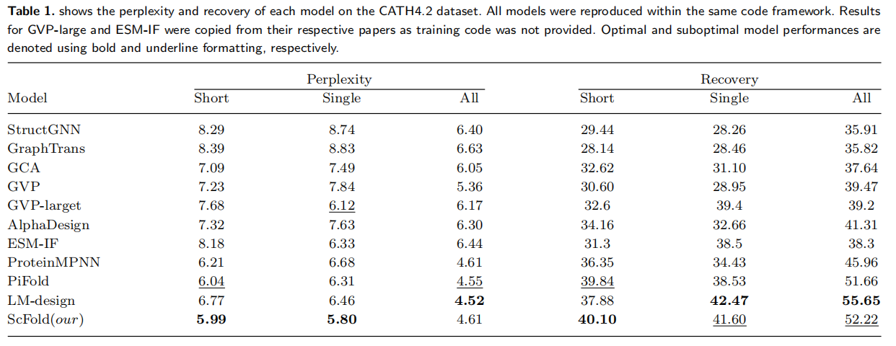
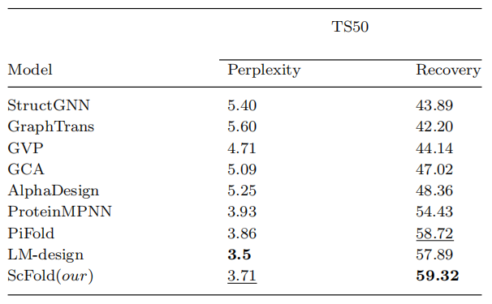
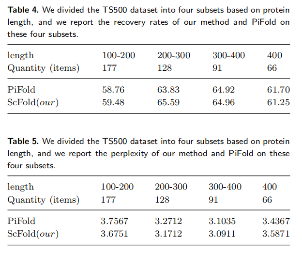

<!-- <div align="center"> -->

# Protein Short Chain Inverse Folding Based on Graph Neural Networks and Spatial Reduction
This codebase is an open-source project for testing structure-based protein short-chain reverse folding methods, providing test results across multiple datasets while adhering to established evaluation metrics. Additionally, we include the implementation code for the paper.
## Introduction
In the realm of protein design, the efficient construction of protein sequences that accurately fold according to predefined structure has emerged as a significant area of research. 
Research on long-chain proteins has made significant advancements, however, the design of short-chain proteins also warrants considerable attention. Key objectives in this field include enhancing model recovery rates, improving generalization, and reducing perplexity. In this study, we present ScFold, a novel model that features an innovative node module. 
This module utilizes spatial reduction and positional encoding mechanisms, which enhance the extraction of structural features, thereby improving recovery rates.Experiments reveal that ScFold achieves a recovery rate of 52.22% on the CATH4.2 dataset, with good performance on single chains, reaching a recovery rate of 41.6% Additionally, perplexity for short and single chains is reduced to below 6. 
ScFold also demonstrates enhanced recovery rates of 59.32% and 61.59% on the TS50 and TS500 datasets, respectively.
## Overall Framework
We illustrates the entire ScFold framework, where the input is the protein structure and the output is the protein sequence expected to fold into the input structure. We introduce a novel node module within the model, 
featuring parallel attention mechanisms, complemented by edge and global modules to enable multi-scale learning of residue features. 
Compared to previous graph models, ScFold can generate amino acid sequences from the protein structure in a single pass, achieving a higher recovery rate. 

<p align="center">
  
</p>

## Code Structures
- `API/` Including preprocessing and format conversion of the dataset.
- `data/` Download link for the dataset.
- `methods/prodesign/` Detailed implementation of the model methodology, including training, validation, testing, calculation of recovery rate, and implementation of the loss function.
- `methods/prodesign_model/` The model architecture is presented, along with the calculation methods for distance, direction, and angle features.
- `methods/prodesign_module/` Detailed methods for each module of the model, including the construction of the graph neural network, as well as the encoder and decoder.
- `utils/` The specific implementation of the feature calculation methods.
- `results/` Including the storage of the optimal model, log files for model execution, and model configuration.

</details>

## Results 
We compared recent graph models on the CATH 4.2 and TS50 datasets. Additionally, we divided the TS500 dataset into four subsets based on sequence length and evaluated the performance of PiFold on these subsets.

<p align="center">
  
</p>

<p align="center">
  
</p>
<p align="center">
  
</p>

## Installation
```bash
# clone project
git clone https://github.com/zzwclass/ScFlod.git
cd ScFold

# create conda virtual environment
env_name=ScFold

conda create -n ${env_name} python=3.7 pip
conda activate ${env_name}

# automatically install everything else
bash install.sh
```

### Data

**Download the preproceesd CATH datasets**
- CATH 4.2 dataset provided by [Generative Models for Graph-Based Protein Design (Ingraham et al, NeurIPS'19)](https://papers.nips.cc/paper/2019/hash/f3a4ff4839c56a5f460c88cce3666a2b-Abstract.html)
```bash
bash data/download_dataset.sh
```
### Model Training

```shell
python main.py --method {method} 
```


## Feedback
If you have any issue about this work, please feel free to contact me by email: 
* Zhiwei Zou: 2265126956@qq.com
* Jie Qiu: 459616055@qq.com
